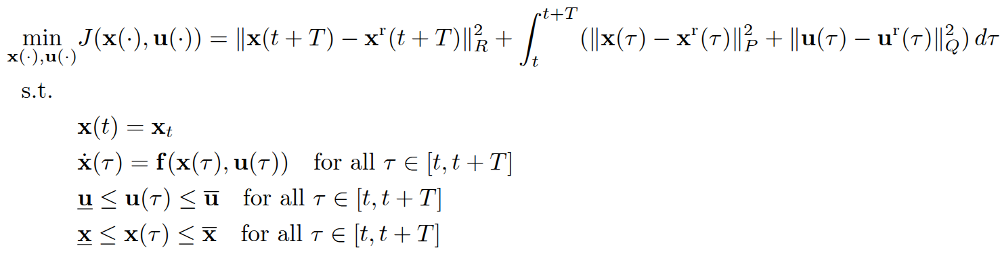
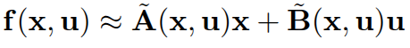
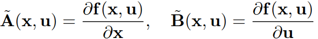
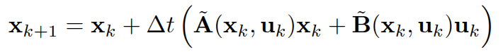
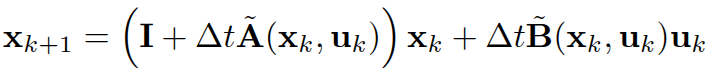
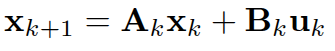
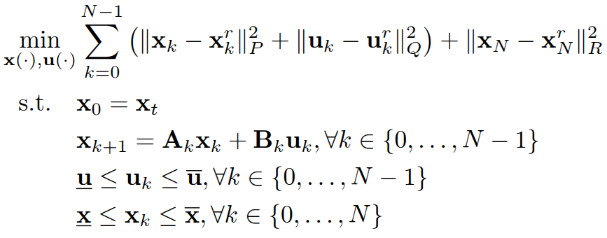
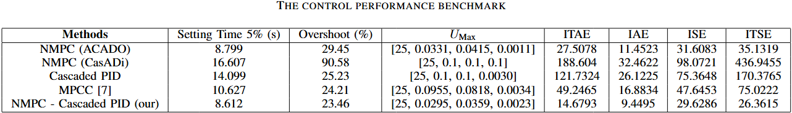
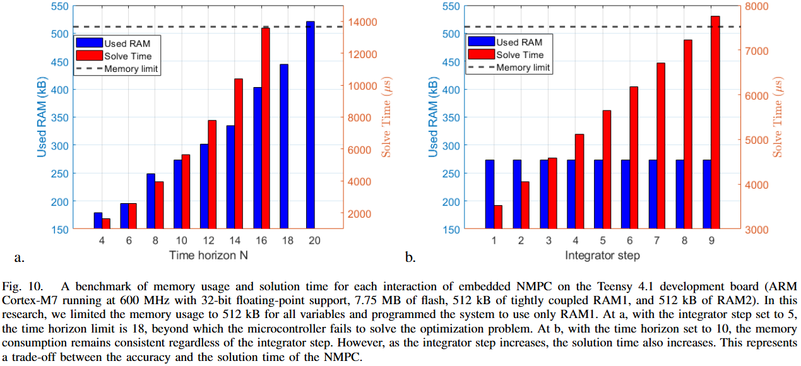
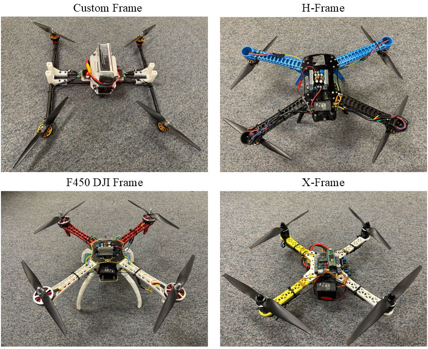

# NMPCM : Nonlinear Model Predictive Control on Resource-Constrained Microcontrollers
We are considering the NMPC with the following formulation:

To approximate the nonlinear dynamical function, we use its Jacobian at each time step:



where:



Thus, the linearized model can be rewritten as:



which simplifies to:



Hence, the nonlinear dynamical model can be approximated at each time step by:



Then the NMPC becomes the QP problem as: 



Then, in order to solve the NMPC, we used the RK4 integration method and the qpOASES solver to solve the QP problem. Utilizing the code generation of ACADO and the qpOASES library, the generated code was then embedded into the microcontroller to solve the NMPC in real time.


# Code Generation
The code generation is based on ACADO code generation and the qpOASES solver; therefore, the following libraries are required:
- ACADO Toolkit (https://acado.github.io/)
- qpOASES (https://github.com/coin-or/qpOASES)

In order to generate the code of the NMPCM, follow these commands:
```shell
# Step 1: Clone the repository and download the ACADO code generation folder
$ Download the acadogenquad folder from the main branch.

# Step 2: Navigate to the ACADO workspace and generate the code
$ cd acadogenquad/build
$ cmake ..
$ make

# Step 3: Run the code generation
$ cd ./acadogenquad
```
Now, the generated code is located in the acadogen_quad folder, which includes the necessary include directory required to run NMPCM. For more details on code generation, the author strongly recommends visiting: [ACADO Getting Started Guide](https://docs.ros.org/en/kinetic/api/acado/html/sim_getting_started.html)

# Simulations
## Software Requirements & Setup

The simulation is configured with the following setup:
- Ubuntu 22.04
- ROS2 Humble
- Gazebo 11
- Xarco-ROS-Humble (sudo apt install ros-humble-xacro)
- Gazebo_ros_pkgs (sudo apt install ros-humble-gazebo-ros-pkgs)
- ACADO Toolkit (https://acado.github.io/)


Follow these commands in order to install the simulation of NMPC-PID on ROS 2:

```shell
# Step 1: Create and build a colcon workspace:
$ mkdir -p ~/dev_ws/src
$ cd ~/dev_ws/
$ colcon build
$ echo "source ~/dev_ws/devel/setup.bash" >> ~/.bashrc

# Step 2: Clone this repo into your workspace
$ cd ~/dev_ws/src
Download the folder nmpcpidquad in the main branch

# Step 3: Build the colcon workspace for this package
$ cd ~/dev_ws
$ colcon build
```
Note that the package contains the code generation and includes the qpOASES library. If the user wants to use NMPCM for a different problem, they need to regenerate the code and replace it to the include folder.

Moreover, we also compare our method with state-of-the-art solver using CasADi, the code to run the NMPC based on CasADi is in the nmpccasadiquad folder, to run this the user must to install the [CasADi](https://github.com/zehuilu/Tutorial-on-CasADi-with-CPP). 

To install the simulation of NMPC based on CasADi on ROS 2:
```shell
# Step 1: Create and build a colcon workspace:
$ mkdir -p ~/dev_ws/src
$ cd ~/dev_ws/
$ colcon build
$ echo "source ~/dev_ws/devel/setup.bash" >> ~/.bashrc

# Step 2: Clone this repo into your workspace
$ cd ~/dev_ws/src
Download the folder nmpccasadiquad in the main branch

# Step 3: Build the colcon workspace for this package
$ cd ~/dev_ws
$ colcon build
```

To run the NMPCM simulation, follow these commands:
```shell
# Step 1: Run the Gazebo model:
$ ros2 launch nmpcpidquad model.launch.py

# Step 2: Run the controller
$ ros2 run nmpcpidquad nmpcpidquad %for the nmpcm
or run
$ ros2 run nmpcpidquad cascadedpid %for the cascaded pid
```
To run the NMPC based on CasADi, follow these commands:

```shell
# Step 1: Run the Gazebo model:
$ ros2 launch nmpccasadiquad model.launch.py

# Step 2: Run the controller
$ ros2 run nmpccasadiquad nmpccasadiquad 
```
* Note that this project uses a custom plugin. Users need to replace the plugin path in the file /urdf/uav_drone.urdf.xacro at line 268. Replace: filename="/home/username/dev_ws/install/nmpcpidquad/lib/nmpcpidquad/libuavplugin.so" with the correct path by changing the username to the name of your computer. Then rebuild the project again to run the simulation.

Moreover, we also compare our controller with the state-of-the-art Model Predictive Contouring Control (MPCC). The performance details are provided in this table:



# Experiments
## Hardware Setups
We used the following sensors and receivers for the quadrotors:
- Teensy 4.1 
- MPU 6050
- Micoair MTF-02 optical flow and LiDAR sensor
- FrSky X8R radio receiver

## Embedded library
To embed the controller onto the Teensy 4.1, the user must download the ArduinoNMPC folder. This folder contains the library for NMPC (Nonlinear Model Predictive Control) and the implemented code for the quadrotor. The user must copy the code generation library into the libraries folder of the Arduino IDE and then upload the sketch nmpcpidteensy.ino to the Teensy 4.1. As discussed earlier, if the user wants to run their own NMPC controller for another system, they must generate the code according to the specific problem and then replace all the generated files in the library to update the embedded code. (Note that qpOASES is already included in the library.)

* Note: The embedded code may have some missing includes in the acado_qpoases_interface.cpp file. To fix this, change: #include "INCLUDE/EXTRAS/SolutionAnalysis.hpp" to #include "SolutionAnalysis.hpp" and change #include "INCLUDE/QProblemB.hpp" to #include "QProblemB.hpp".
## Results
We verified the efficiency of our control method for real-time execution on the resource-constrained Teensy 4.1 microcontroller and implemented our flight controller across various quadrotor platforms. The solving time of the NMPCM is shown on that figure: 



We tested the controller with four types of drone frame:



# Contact
- [Van Chung Nguyen](mailto:vanchungn@.unr.edu)
- [Hung La](mailto:hla@unr.edu)
